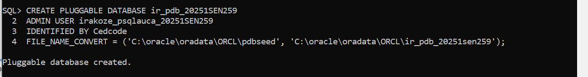
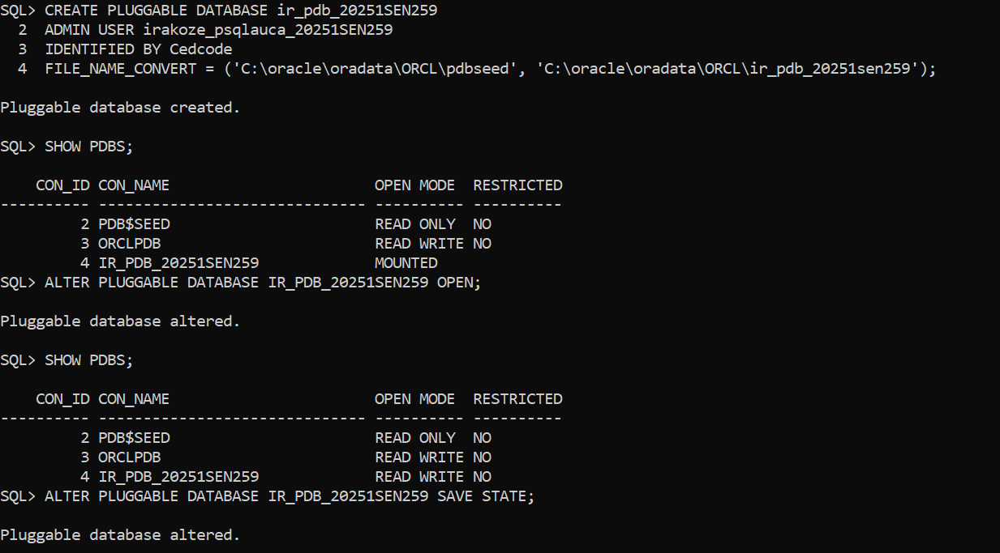
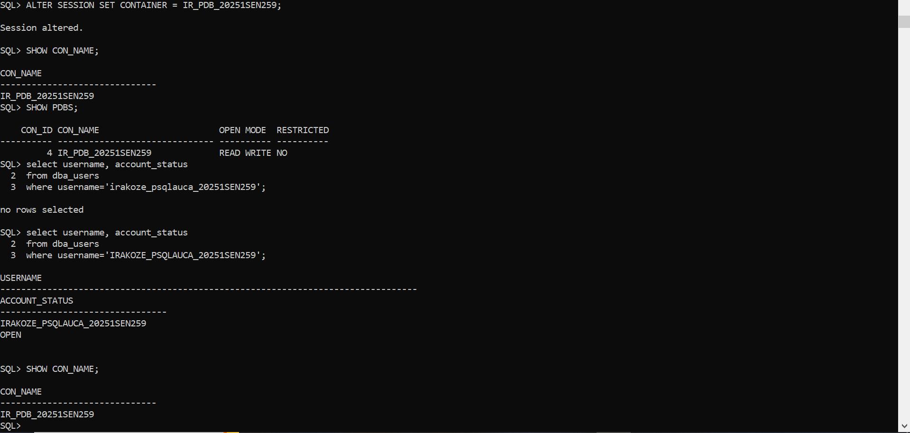
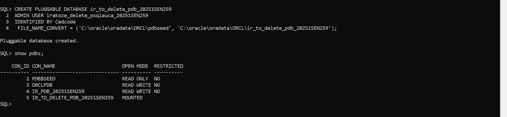
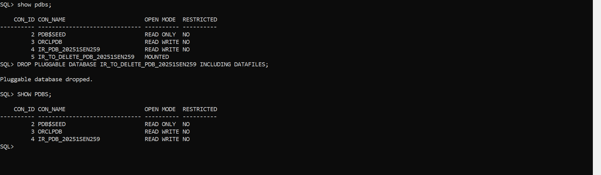
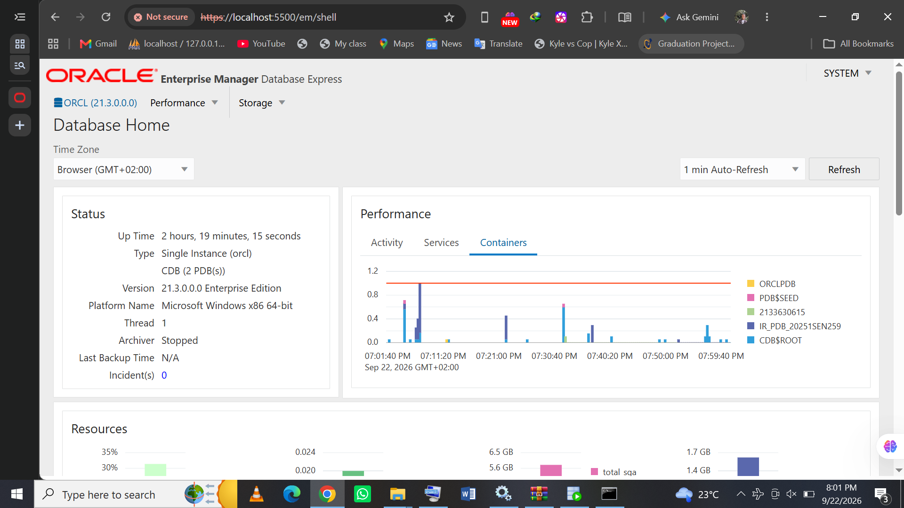

# Oracle Pluggable Databases (PDB) Management – Assignment II

## Student Information

- **First Name:** Irakoze Peace Cedrick
- **Student ID:** 20251SEN259
- **Course:** Database Development with PL/SQL (INSY 8311)
- **Database:** Oracle Database 21c Enterprise Edition
- **Operating System:** Microsoft Windows

---

## Overview

This repository contains the work I did for the Oracle Pluggable
Databases management assignment.

The main purpose of the assignment was to practice working with Oracle
Multitenant Architecture. During the practical work, I created a new
pluggable database, opened it, checked its status and worked inside it.

I also created another temporary PDB and later deleted it. Finally, I
used Oracle Enterprise Manager Database Express to view the database
environment and confirm that my PDB was available.

The screenshots below show the main steps and results of the work.

---

## Oracle Environment

I used the following environment during the assignment:

- **Oracle Database:** Oracle Database 21c Enterprise Edition
- **Container Database (CDB):** ORCL
- **Default PDB:** ORCLPDB
- **Created PDB:** IR_PDB_20251SEN259
- **Operating System:** Microsoft Windows x86 64-bit
- **Command Line Tool:** SQL*Plus
- **Database Management Tool:** Oracle SQL Developer
- **Monitoring Tool:** Oracle Enterprise Manager Database Express

---

# Task 1 – Creating and Configuring a PDB

For the first task, I created a new pluggable database using my
student information.

The PDB name I used was:

`IR_PDB_20251SEN259`

## PDB Creation

The screenshot below shows the creation of the PDB. Oracle returned
the message `Pluggable database created`, confirming that the operation
was successful.



## Opening the PDB

After creating the PDB, I checked the available pluggable databases.

At first, `IR_PDB_20251SEN259` was in `MOUNTED` mode. I then opened
the PDB and checked the PDBs again.

After opening it, the status changed to `READ WRITE`.

I also saved the state of the PDB so that Oracle can preserve its open
state.



## Checking the Container and User

I changed my current session from the root container to
`IR_PDB_20251SEN259`.

I used `SHOW CON_NAME` to confirm that my session was working inside
the correct PDB.

I also checked the user account inside the PDB and confirmed that the
account was open.



---

# Task 2 – Creating and Deleting a Temporary PDB

The second task was to create another PDB and then completely remove
it from the database.

The temporary PDB was:

`IR_TO_DELETE_PDB_20251SEN259`

## Creating the Temporary PDB

I created the temporary PDB and then checked the available PDBs.

The result of `SHOW PDBS` displayed
`IR_TO_DELETE_PDB_20251SEN259`, which confirmed that the PDB had
been created successfully.

At this stage, the temporary PDB was in `MOUNTED` mode.



## Deleting the Temporary PDB

After confirming that the temporary PDB existed, I deleted it,
including its associated datafiles.

Oracle returned the message:

`Pluggable database dropped.`

I then checked the PDB list again.

The final result no longer contained
`IR_TO_DELETE_PDB_20251SEN259`. My main PDB,
`IR_PDB_20251SEN259`, was still available and in `READ WRITE` mode.

This confirmed that the temporary PDB had been removed successfully.



---

# Task 3 – Oracle Enterprise Manager

For this task, I used Oracle Enterprise Manager Database Express to
view information about my Oracle database.

I accessed the Database Express interface through the local Oracle
HTTPS service.

The dashboard showed that I was working with Oracle Database 21c
Enterprise Edition running as a single `ORCL` instance on Microsoft
Windows.

I opened the **Containers** section of the Performance dashboard. It
showed different containers from my Oracle environment, including:

- `ORCLPDB`
- `PDB$SEED`
- `IR_PDB_20251SEN259`
- `CDB$ROOT`

My created PDB, `IR_PDB_20251SEN259`, was therefore visible from
Oracle Enterprise Manager.

The screenshot also shows that I accessed Enterprise Manager using the
`SYSTEM` account.



---

# Challenges Encountered

I faced a few problems while completing the practical work.

One of the problems was understanding the different states of a
pluggable database. After creating my PDB, it was shown as `MOUNTED`.
I had to open it before it could appear as `READ WRITE`. This helped
me understand that creating a PDB does not necessarily mean that it is
already open for normal operations.

I also had a connection problem when configuring SQL Developer. I
initially used incorrect connection information. After checking the
Oracle listener and its registered services, I was able to use the
correct service and connect to the database.

Another problem occurred when I tried to access Oracle Enterprise
Manager. Because it was using HTTPS locally, the browser displayed a
certificate warning. I checked the Oracle configuration and confirmed
that Database Express was using HTTPS port 5500. I was then able to
access the OEM dashboard.

These problems gave me more practical understanding of PDB states,
Oracle services and database management tools.

---

# What I Learned

This assignment helped me understand Oracle Multitenant Architecture
better.

Before doing the practical work, I mainly understood PDBs from theory.
During the assignment, I was able to create a PDB myself and see the
difference between the `MOUNTED` and `READ WRITE` states.

I also learned how to change the current container, check the current
PDB, verify users, create and remove a temporary PDB, and use
`SHOW PDBS` to verify the results of database operations.

Using Oracle Enterprise Manager also helped me see the database from
a graphical interface instead of only using SQL*Plus.

---

# Repository Structure

The repository is organized as follows:

```text
oracle_pdb_ass_II_20251SEN259_irakoze/
│
├── README.md
│
└── screenshots/
    │
    ├── pdb_creation/
    │   ├── 1.png
    │   ├── 2.png
    │   └── 3.png
    │
    ├── pdb_deletion/
    │   ├── 2_1.png
    │   └── 2_2.png
    │
    └── oem_dashboard/
        └── 3_1.png#
